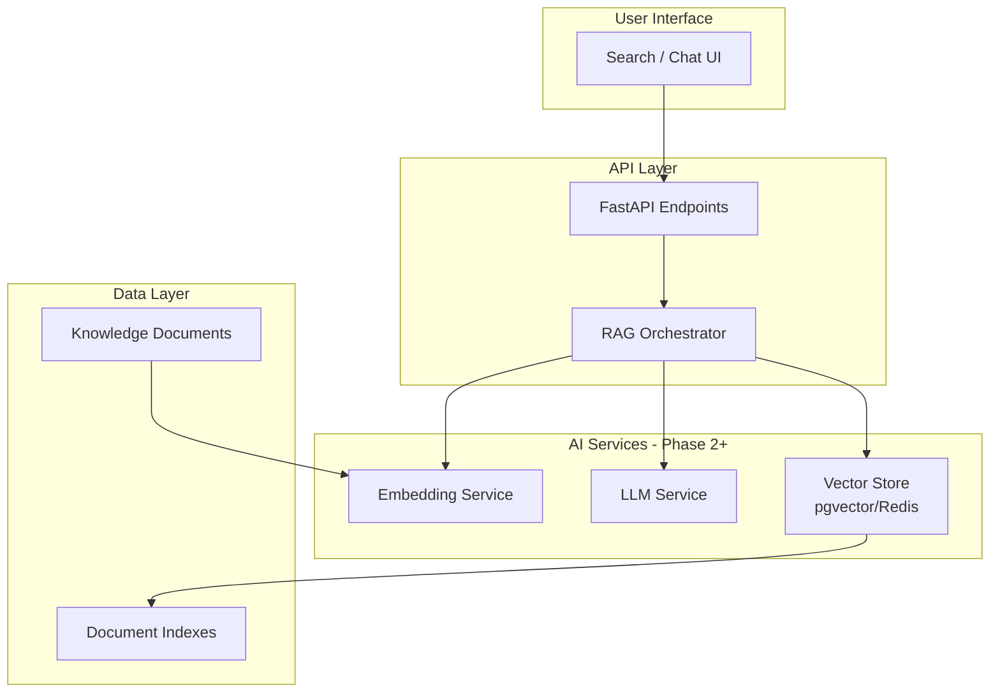
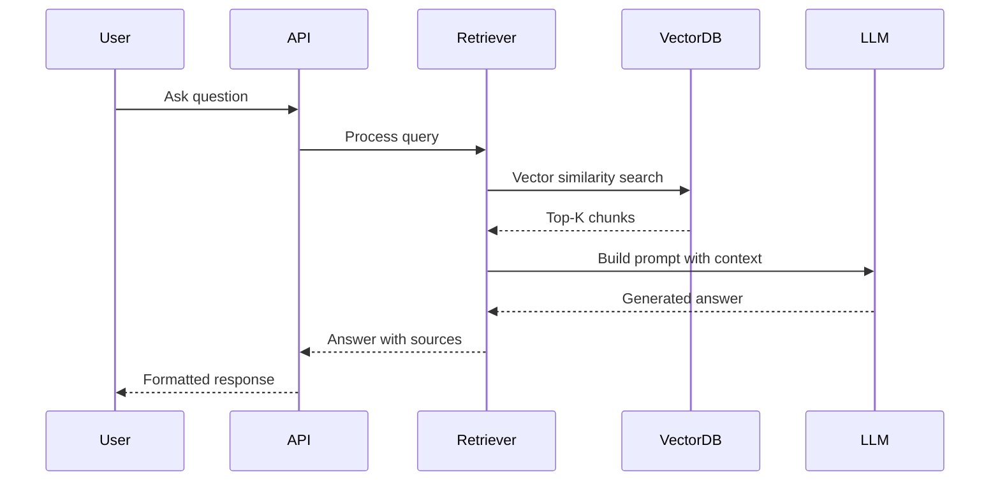

# AI/RAG Architecture

> **Status**: Phase 2+ - SPECIFICATION ONLY  
> **Last Updated**: 2024-01-XX  
> **Version**: 0.1.0

## ⚠️ CRITICAL: MOST OF THIS IS PLANNED/SPECIFICATION ONLY

**Current Implementation Status (Phase 0):**
- ❌ No AI/ML features implemented
- ❌ No RAG pipeline exists
- ❌ No vector database configured
- ✅ Job framework defined (for future AI jobs)

This document describes the PLANNED architecture for Phase 2+. Do not assume any of this works yet.

---

## Overview

The AI/RAG (Retrieval-Augmented Generation) architecture will enable:
- Semantic search over knowledge documents
- Natural language Q&A about financial crime topics
- Intelligent document summarization
- Context-aware recommendations

---

## Planned Architecture



---

## Component Specifications (All Planned)

### 1. Embedding Generation Service

| Aspect | Specification |
|--------|---------------|
| **Purpose** | Convert text to vector representations |
| **Model** | OpenAI text-embedding-ada-002 or local alternative |
| **Input** | Document chunks (~500-1000 tokens) |
| **Output** | 1536-dimensional vectors |
| **Storage** | pgvector column in PostgreSQL |
| **Job Type** | `embedding_generation` |

### 2. Vector Store

| Aspect | Specification |
|--------|---------------|
| **Technology** | pgvector extension on PostgreSQL |
| **Index Type** | HNSW for approximate search |
| **Dimensions** | 1536 (OpenAI) or configurable |
| **Distance Metric** | Cosine similarity |

### 3. RAG Pipeline



### 4. LLM Integration

| Feature | Planned Capability |
|---------|-------------------|
| Q&A | Answer questions using knowledge base |
| Summarization | Generate document summaries |
| Extraction | Extract entities, relationships |
| Classification | Classify document types/topics |

---

## Provider Abstraction Layer

To avoid vendor lock-in:

```python
# Planned interface (NOT IMPLEMENTED)
class EmbeddingProvider(ABC):
    async def embed_text(self, text: str) -> list[float]: ...
    async def embed_batch(self, texts: list[str]) -> list[list[float]]: ...

class LLMProvider(ABC):
    async def complete(self, prompt: str, context: list[str]) -> str: ...
    async def stream_complete(self, prompt: str, context: list[str]) -> AsyncIterator[str]: ...
```

### Supported Providers (Planned)
- OpenAI (GPT-4, embeddings)
- Azure OpenAI
- Local models via Ollama (Phase 3)
- Anthropic Claude (future)

---

## Security Considerations for AI

### Data Privacy
- No PII sent to external APIs without consent
- Option for fully local deployment
- Audit logging of all AI interactions

### Output Safety
- Guardrails against harmful content
- Citation requirements for answers
- Confidence scoring for responses

### Cost Controls
- Rate limiting per user/organization
- Token usage monitoring
- Budget alerts and caps

---

## Implementation Timeline

| Phase | Components | Status |
|-------|------------|--------|
| Phase 0 | Job definitions only | ✅ Done |
| Phase 1 | None (focus on core features) | ⚪ Planned |
| Phase 2 | Embeddings, vector search, basic RAG | ⚪ Planned |
| Phase 3 | Advanced RAG, local models, fine-tuning | ⚪ Planned |

---

## Related Documents

- [Search Architecture](SEARCH_ARCHITECTURE.md)
- [System Architecture](SYSTEM_ARCHITECTURE.md)
- ADR-0005: Authentication Strategy
