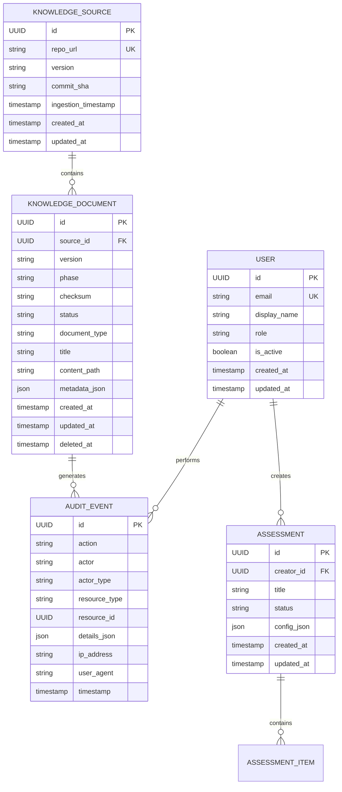

# Domain Model

> **Status**: Phase 0 - Foundation  
> **Last Updated**: 2024-01-XX  
> **Version**: 0.1.0

## Overview

This document describes the core domain entities of the Financial Crime Knowledge Engine and their relationships.

---

## Entity Relationship Diagram



---

## Core Entities

### KnowledgeSource
Represents an external knowledge repository (e.g., the Knowledge Base git repo).

| Attribute | Type | Description |
|-----------|------|-------------|
| id | UUID | Primary key |
| repo_url | String (512) | Git repository URL, unique |
| version | String (64) | Version tag/branch |
| commit_sha | String (64) | Last ingested commit hash |
| ingestion_timestamp | DateTime | When last ingestion completed |

**Status**: ✅ IMPLEMENTED (schema exists)

### KnowledgeDocument
An individual piece of knowledge ingested from a source.

| Attribute | Type | Description |
|-----------|------|-------------|
| id | UUID | Primary key |
| source_id | UUID (FK) | Parent knowledge source |
| version | String (64) | Document version identifier |
| phase | String (32) | Origin phase (phase0, phase1, etc.) |
| checksum | String (128) | SHA-256 content hash |
| status | String (32) | Processing status |
| document_type | String (64) | Classification type |
| title | String (512) | Human-readable title |
| metadata_json | JSONB | Flexible metadata storage |
| deleted_at | DateTime | Soft delete timestamp |

**Status**: ✅ IMPLEMENTED (schema exists)

### AuditEvent
Immutable record of actions for compliance and debugging.

| Attribute | Type | Description |
|-----------|------|-------------|
| id | UUID | Primary key |
| action | String (128) | Action performed |
| actor | String (256) | Who performed it |
| actor_type | String (64) | user/system/api_key/worker |
| resource_type | String (128) | Target entity type |
| resource_id | UUID | Target entity ID |
| details_json | JSONB | Additional context |
| ip_address | String (45) | Request IP |
| timestamp | DateTime | When action occurred |

**Status**: ✅ IMPLEMENTED (schema exists)

### User (Planned for Phase 1)
Platform user account.

| Attribute | Type | Description |
|-----------|------|-------------|
| id | UUID | Primary key |
| email | String (UK) | Unique email address |
| display_name | String | Human-readable name |
| role | String | RBAC role |
| is_active | Boolean | Account active flag |

**Status**: ⚪ PLANNED

### Assessment (Planned for Phase 3)
Risk assessment workflow and results.

| Attribute | Type | Description |
|-----------|------|-------------|
| id | UUID | Primary key |
| creator_id | UUID (FK) | User who created assessment |
| title | String | Assessment name |
| status | String | Workflow state |
| config_json | JSONB | Assessment configuration |

**Status**: ⚪ PLANNED

---

## Value Objects

### DocumentType Enumeration
```python
class DocumentType(str, Enum):
    REGULATION = "regulation"
    GUIDANCE = "guidance"
    DEFINITION = "definition"
    CASE_STUDY = "case_study"
    TAXONOMY = "taxonomy"
    PROCEDURE = "procedure"
    FAQ = "faq"
    GLOSSARY = "glossary"
```

### DocumentStatus Enumeration
```python
class DocumentStatus(str, Enum):
    PENDING = "pending"          # Awaiting processing
    PROCESSING = "processing"    # Being processed
    ACTIVE = "active"            # Available for use
    ERROR = "error"              # Processing failed
    ARCHIVED = "archived"        # No longer active
```

---

## Relationships Summary

| Relationship | Cardinality | Status |
|--------------|-------------|--------|
| Source → Documents | 1:N | ✅ Schema defined |
| Document → Audit Events | 1:N | ✅ Schema defined |
| User → Assessments | 1:N | ⚪ Planned |
| User → Audit Events | 1:N | ⚪ Planned |

---

## Related Documents

- [Source of Truth](SOURCE_OF_TRUTH.md)
- [Knowledge Base Integration](KNOWLEDGE_BASE_INTEGRATION.md)
- ADR-0003: Database Design
