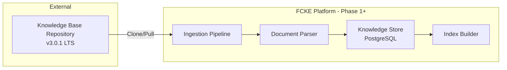

# Knowledge Base Integration

> **Status**: Phase 0 - Specification Only  
> **Last Updated**: 2024-01-XX  
> **Version**: 0.1.0

## Overview

This document defines the integration contract between the Financial Crime Knowledge Engine (software implementation) and the Knowledge Base (specification repository).

### Key Principle
**This repository (software) is SEPARATE from the Knowledge Base repository.** We do not copy Knowledge Base content into this repo.

---

## Integration Architecture



---

## Ingestion Pipeline Specification

### Phase 0 Status: **SPECIFICATION ONLY**

The ingestion pipeline is designed but not yet implemented.

### Planned Flow

1. **Trigger**
   - Scheduled (cron job)
   - Manual (admin action)
   - Webhook (repository push)

2. **Fetch**
   - Clone or pull Knowledge Base repository
   - Verify commit SHA matches expected version

3. **Parse**
   - Walk directory structure
   - Identify document types by path/location
   - Extract metadata from frontmatter/headers

4. **Validate**
   - Check schema compliance
   - Verify required fields present
   - Calculate content checksums

5. **Store**
   - Upsert to `knowledge_documents` table
   - Update `knowledge_sources` with version info
   - Record audit events

6. **Index** (Phase 2)
   - Generate vector embeddings
   - Build search indexes
   - Update graph relationships

---

## Source Manifest Format

### Manifest Schema (Planned)

```yaml
# knowledge_manifest.yaml
api_version: v1
source:
  repo_url: https://github.com/fcke/knowledge-base
  version: v3.0.1
  commit_sha: abc123def456...
  ingestion_timestamp: 2024-01-15T10:30:00Z

documents:
  total_count: 1500
  by_type:
    regulation: 200
    guidance: 350
    definition: 400
    case_study: 250
    taxonomy: 300

phases:
  - name: phase0
    path: /phase0/
    count: 50
  - name: phase1
    path: /phase1/
    count: 500
  # ... etc

checksums:
  algorithm: sha256
  manifest: "hash_here..."
```

---

## Provenance Tracking Requirements

Every ingested document must track:

| Field | Source | Description |
|-------|--------|-------------|
| source_id | FK | Reference to knowledge_sources row |
| version | Manifest | Version string from manifest |
| phase | Path | Which phase directory |
| checksum | Calculated | SHA-256 of raw content |
| original_path | Repo | Relative path in repository |
| ingestion_job_id | System | Job that performed ingestion |

### Audit Trail Requirements

For compliance, we must record:
- When each document was ingested
- Who/what triggered the ingestion
- What changed between versions
- Any validation warnings/errors

---

## Document Type Taxonomy (from Knowledge Base)

| Type | Description | Example Paths |
|------|-------------|---------------|
| Regulation | Legal/regulatory texts | `/regulations/` |
| Guidance | Regulatory guidance | `/guidance/` |
| Definition | Term definitions | `/definitions/` |
| Case Study | Real-world examples | `/case-studies/` |
| Taxonomy | Classification systems | `/taxonomies/` |
| Procedure | Operational procedures | `/procedures/` |

---

## Implementation Status

| Component | Phase 0 Status |
|-----------|----------------|
| Ingestion Job Definition | ✅ SCAFFOLDED (job_base.py) |
| Document Parser | ⚪ PLANNED |
| Manifest Parser | ⚪ PLANNED |
| Checksum Calculator | ⚪ PLANNED |
| Provenance Recorder | ⚪ PLANNED |

---

## Related Documents

- [Source of Truth](SOURCE_OF_TRUTH.md)
- [Domain Model](DOMAIN_MODEL.md)
- [System Architecture](SYSTEM_ARCHITECTURE.md)
- ADR-0003: Database Design
