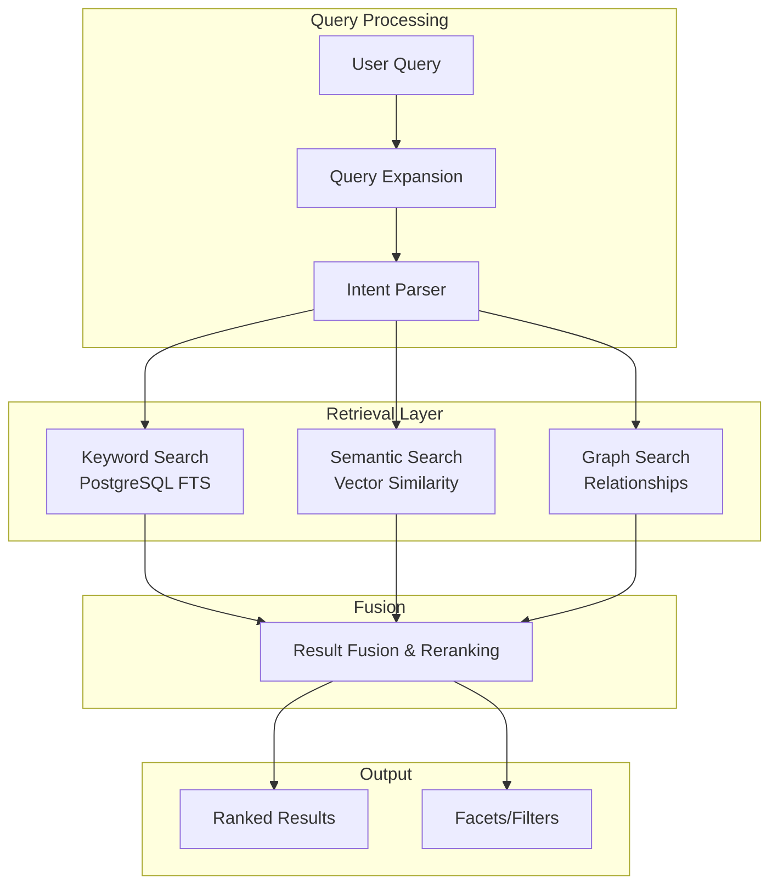

# Search Architecture

> **Status**: Phase 0 (Basic) / Phase 2+ (Advanced - Planned)  
> **Last Updated**: 2024-01-XX  
> **Version**: 0.1.0

## Overview

This document describes the search architecture for FCKE, from current basic implementation to future advanced capabilities.

---

## Current Implementation: Phase 0

### What Works Now
- ✅ PostgreSQL full-text search capability (schema supports it)
- ✅ Basic SQL queries with LIKE/ILIKE
- ✅ Document type filtering
- ✅ Status-based filtering

### What's Available via Database
```sql
-- Basic text search (can be implemented now)
SELECT * FROM knowledge_documents 
WHERE title ILIKE '%search term%'
  AND status = 'active'
  AND deleted_at IS NULL
ORDER BY created_at DESC;
```

---

## Planned Architecture: Hybrid Retrieval (Phase 2+)



---

## Search Strategies

### 1. Keyword Search (Phase 0: Available, Phase 2+: Enhanced)

| Feature | Phase 0 | Phase 2+ |
|---------|---------|----------|
| Basic text matching | ✅ SQL LIKE | ✅ PostgreSQL FTS |
| Stemming | ❌ | ✅ English stemmer |
| Relevance ranking | ❌ | ✅ ts_rank |
| Highlighting | ❌ | ✅ ts_headline |
| Faceted search | ❌ | ✅ Aggregation |

### 2. Semantic Search (Phase 2+: Planned)

| Feature | Description |
|---------|-------------|
| Vector embeddings | Document chunks → vectors |
| Similarity search | Cosine similarity in vector space |
| Query embedding | Convert user query to vector |
| Hybrid scoring | Combine keyword + semantic scores |

### 3. Graph Search (Phase 2+: Planned)

| Feature | Description |
|---------|-------------|
| Entity relationships | Find related concepts |
| Path traversal | Follow knowledge connections |
| Multi-hop reasoning | Chain relationships |

---

## API Design (Planned)

```yaml
# POST /v1/search
request:
  query: string              # Search query
  filters:
    document_type: []        # Filter by type
    phase: []                # Filter by phase
    date_range: {}           # Date range filter
  options:
    page: 1                  # Pagination
    page_size: 20
    mode: hybrid             # keyword | semantic | graph | hybrid
    
response:
  results: []
  total: int
  facets: {}
  suggestions: []            # Did you mean?
  search_id: string          # For analytics
```

---

## Indexing Strategy

### Phase 0 (Current)
- B-tree indexes on common filter columns
- No dedicated search index

### Phase 2+ (Planned)
```sql
-- Full-text search index
CREATE INDEX idx_docs_fts ON knowledge_documents 
USING GIN(to_tsvector('english', title || ' ' || COALESCE(metadata_json->>'content', '')));

-- Vector index (pgvector)
CREATE INDEX idx_docs_vector ON knowledge_documents 
USING hnsw(embedding vector_cosine_ops);
```

---

## Performance Targets (Phase 2+)

| Metric | Target | Notes |
|--------|--------|-------|
| P50 latency | < 100ms | Simple queries |
| P99 latency | < 500ms | Complex queries |
| Indexing lag | < 5 min | From document update to searchable |
| Recall@10 | > 90% | For semantic search |

---

## Implementation Status Summary

| Component | Status | Phase |
|-----------|--------|-------|
| Basic SQL queries | ✅ IMPLEMENTED | Phase 0 |
| PostgreSQL FTS | ⚪ PLANNED | Phase 2 |
| Vector embeddings | ⚪ PLANNED | Phase 2 |
| Semantic search | ⚪ PLANNED | Phase 2 |
| Graph search | ⚪ PLANNED | Phase 2 |
| Result fusion/reranking | ⚪ PLANNED | Phase 3 |

---

## Related Documents

- [AI/RAG Architecture](AI_RAG_ARCHITECTURE.md)
- [Domain Model](DOMAIN_MODEL.md)
- [System Architecture](SYSTEM_ARCHITECTURE.md)
