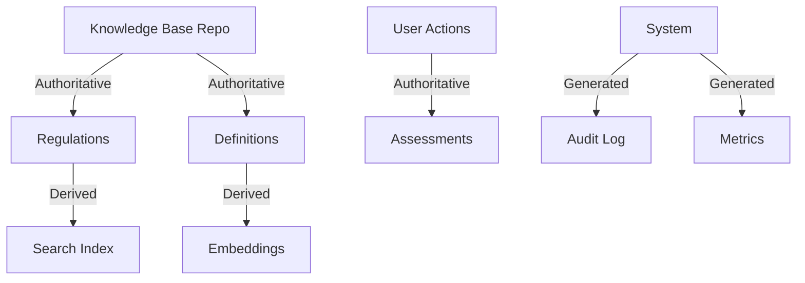

# Source of Truth

> **Status**: Phase 0 - Specification  
> **Last Updated**: 2024-01-XX  
> **Version**: 0.1.0

## Overview

This document defines what constitutes authoritative data in the FCKE platform and how different data sources are classified.

---

## Data Source Classification

### 1. AUTHORITATIVE Sources
Data that is the definitive, canonical source of truth.

| Source | Owner | Update Mechanism | Examples |
|--------|-------|------------------|----------|
| Knowledge Base Repository | External (Spec) | Git commits | Regulations, definitions |
| User-Created Content | Platform Users | CRUD operations | Assessments, notes |
| System Configuration | Administrators | Admin UI/API | Feature flags, settings |

### 2. DERIVED Sources
Data computed or transformed from authoritative sources.

| Source | Derived From | Computation | Refresh |
|--------|--------------|-------------|---------|
| Document Indexes | Knowledge Base | Ingestion pipeline | On ingest |
| Search Vectors | Documents | Embedding model | On change |
| Aggregated Stats | Multiple | Periodic jobs | Scheduled |

### 3. GENERATED Sources
Data created by system processes without direct human input.

| Source | Generator | Purpose | Retention |
|--------|-----------|---------|----------|
| Audit Events | All actions | Compliance trail | Permanent |
| Job Execution Records | Worker | Operational history | 90 days |
| Access Logs | API/Web | Security audit | 1 year |
| Metrics Samples | Collectors | Observability | 30 days |

### 4. USER-GENERATED Sources
Data created by end users through the platform.

| Source | Creator | Examples |
|--------|---------|----------|
| Assessments | Analysts | Risk assessments |
| Annotations | Analysts | Document notes |
| Queries | All users | Saved searches |
| Reports | Analysts | Generated reports |

---

## Authority Rules

### Conflict Resolution
When conflicts arise between data sources:

1. **Authoritative > Derived**: Always trust source over computed values
2. **Newer > Older**: For same-level sources, use latest timestamp
3. **Manual > Automatic**: For user-generated vs system-generated
4. **Explicit > Implicit**: Explicitly set values over defaults

---

## Data Lifecycle

### Creation
- Track provenance (who/what created)
- Assign unique identifier
- Set initial version

### Modification
- Version each change
- Record who modified and when
- Validate against schema

### Deletion
- Prefer soft delete for compliance
- Hard delete only after retention period
- Archive before deletion

### Archival
- Move to cold storage after active period
- Maintain searchability of metadata
- Preserve audit trail indefinitely

---

## Implementation Notes (Phase 0)

Current implementation:
- ✅ Database schema supports soft deletes (`deleted_at`)
- ✅ Audit events table defined
- ⚪ Provenance tracking not yet implemented
- ⚪ Version history not yet implemented

---

## Related Documents

- [Knowledge Base Integration](KNOWLEDGE_BASE_INTEGRATION.md)
- [Domain Model](DOMAIN_MODEL.md)
- [Security Baseline](../security/SECURITY_BASELINE.md)
