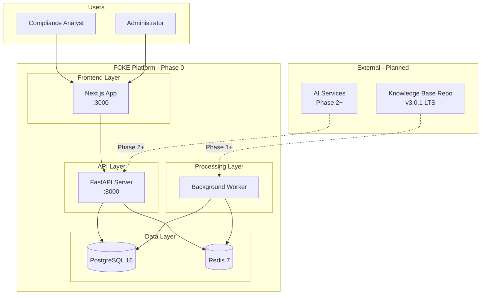
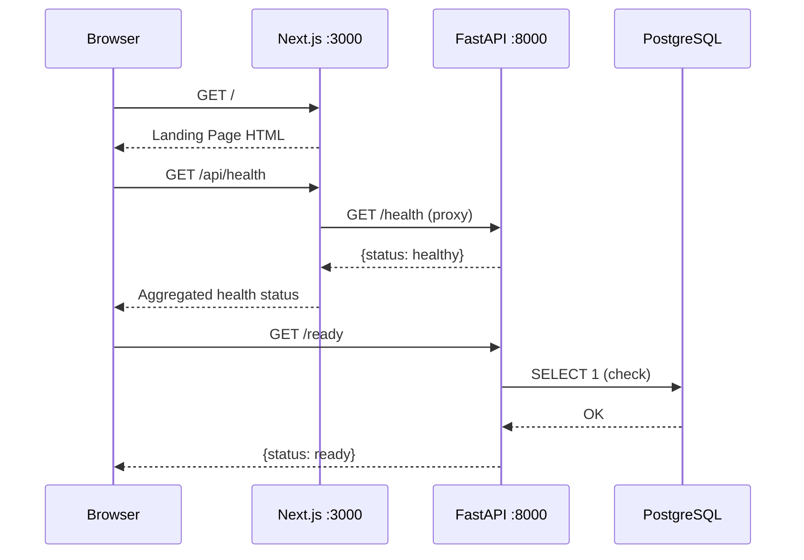
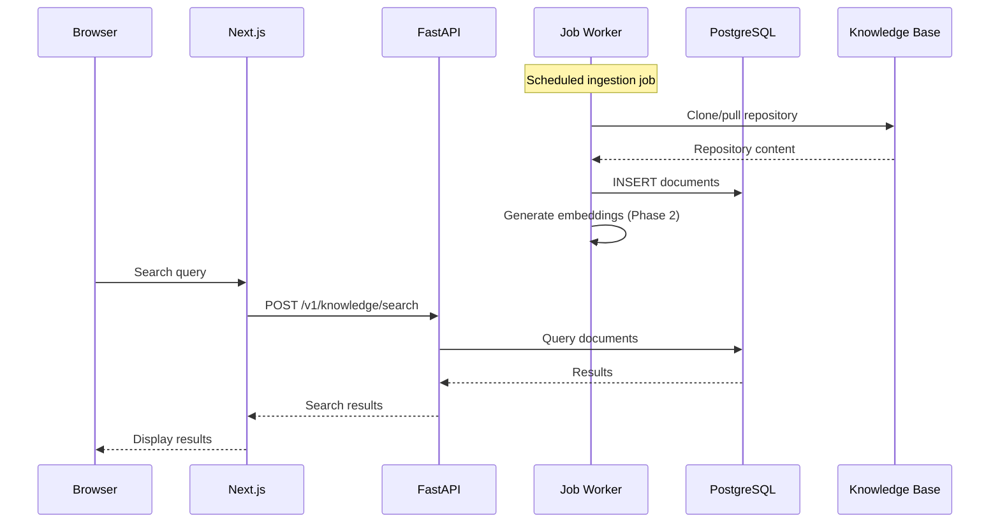
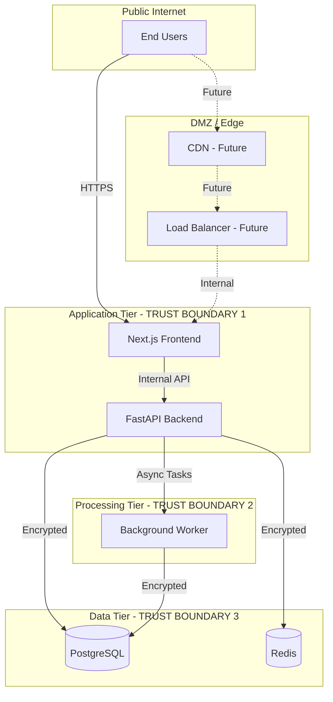
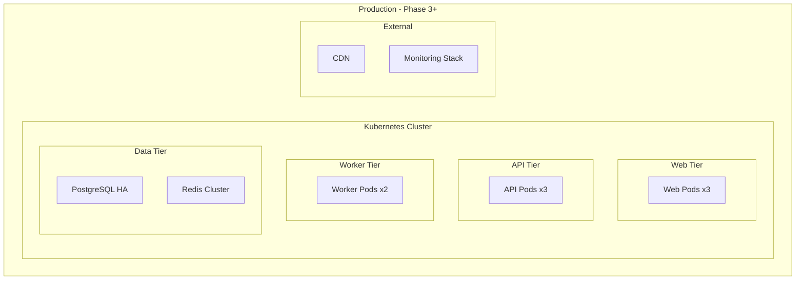

# System Architecture

> **Status**: Phase 0 - Software Foundation  
> **Last Updated**: 2024-01-XX  
> **Version**: 0.1.0

## Overview

The Financial Crime Knowledge Engine (FCKE) is a comprehensive platform for managing, searching, and reasoning about financial crime knowledge. This document describes the system architecture at its current state (Phase 0) and planned future states.

### Current State: Phase 0 - Foundation

At Phase 0, we have established:

| Component | Status | Description |
|-----------|--------|-------------|
| Monorepo Structure | ✅ IMPLEMENTED | pnpm workspaces with apps/* and packages/* |
| Next.js Frontend Shell | ✅ IMPLEMENTED | Landing page with system status display |
| FastAPI Backend Foundation | ✅ IMPLEMENTED | Health checks, config, database setup |
| Worker Framework | ✅ SCAFFOLDED | Job execution model and registry |
| Database Schema | ✅ SCAFFOLDED | Alembic migrations defined |
| Docker Configuration | ✅ IMPLEMENTED | docker-compose with all services |
| CI/CD Pipeline | ✅ IMPLEMENTED | GitHub Actions workflow |

---

## System Context Diagram



---

## Component Architecture

```mermaid
graph LR
    subgraph "apps/web - Next.js Frontend"
        W1[src/app/page.tsx<br/>Landing Page]
        W2[src/app/api/health<br/>Health Proxy]
        W3[src/lib/api-client.ts<br/>API Client]
    end

    subgraph "apps/api - FastAPI Backend"
        A1[app/main.py<br/>Application Entry]
        A2[app/config.py<br/>Configuration]
        A3[app/database.py<br/>DB Session Mgmt]
        A4[app/models/<br/>SQLAlchemy Models]
        A5[app/schemas/<br/>Pydantic Schemas]
        A6[app/core/<br/>Logging & Errors]
        A7[app/api/v1/<br/>API Router]
    end

    subgraph "apps/worker - Background Jobs"
        W1[job_base.py<br/>Abstract Job Class]
        W2[registry.py<br/>Job Registry]
        W3[executor.py<br/>Job Executor]
    end

    subgraph "packages - Shared Code"
        P1[@fcke/ui<br/>UI Components]
        P2[@fcke/knowledge<br/>Domain Types]
        P3[@fcke/sdk<br/>API Client SDK]
        P4[@fcke/shared<br/>Utilities]
    end
```

---

## Data Flow Diagram

### Phase 0 Data Flow (Current)



### Phase 1+ Data Flow (Planned)



---

## Trust Boundaries



**Trust Boundary Notes (Phase 0):**
- All internal communication is currently on Docker network
- TLS termination not yet implemented (planned for Phase 1)
- No authentication layer yet (planned for Phase 1)

---

## Technology Decisions

### Implemented Technologies

| Technology | Version | Purpose | Decision Date |
|------------|---------|---------|---------------|
| Next.js | 15+ | Frontend framework | 2024-01 |
| React | 19+ | UI library | 2024-01 |
| TypeScript | 5+ | Type safety | 2024-01 |
| Tailwind CSS | 4+ | Styling | 2024-01 |
| FastAPI | 0.115+ | API framework | 2024-01 |
| Python | 3.11+ | Backend runtime | 2024-01 |
| SQLAlchemy | 2.0+ | ORM | 2024-01 |
| Pydantic | v2 | Validation | 2024-01 |
| Alembic | - | Migrations | 2024-01 |
| PostgreSQL | 16 | Primary database | 2024-01 |
| Redis | 7 | Cache/broker | 2024-01 |
| Docker | - | Containerization | 2024-01 |
| pnpm | 9+ | JS package manager | 2024-01 |

### Planned Technologies (Future Phases)

| Technology | Target Phase | Purpose |
|------------|--------------|---------|
| OpenAI/LLM APIs | Phase 2 | Embeddings and RAG |
| pgvector | Phase 2 | Vector search |
| Redis Stack | Phase 2 | Vector storage |
| Keycloak/Auth0 | Phase 1 | Authentication |
| Prometheus/Grafana | Phase 2 | Observability |
| Kubernetes | Phase 3 | Orchestration |

---

## Deployment Architecture (Planned)



---

## Status Legend

| Status | Meaning |
|--------|---------|
| ✅ **IMPLEMENTED** | Working code exists and is tested |
| 🟡 **SCAFFOLDED** | Structure exists, minimal logic |
| 🔵 **PLANNED** | Design complete, implementation pending |
| ⚪ **SPECIFICATION_ONLY** | Documentation only |

---

## Related Documents

- [Architecture Decision Records](../adr/)
- [Domain Model](DOMAIN_MODEL.md)
- [Knowledge Base Integration](KNOWLEDGE_BASE_INTEGRATION.md)
- [AI/RAG Architecture](AI_RAG_ARCHITECTURE.md)
- [Search Architecture](SEARCH_ARCHITECTURE.md)
