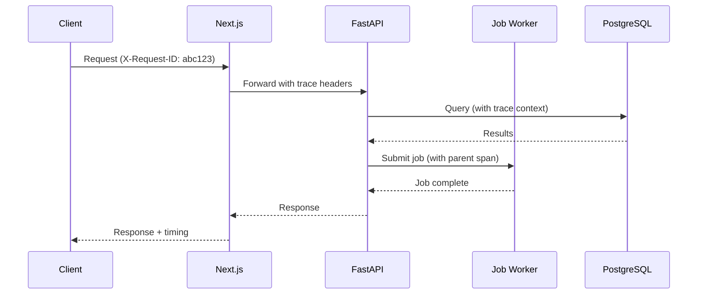

# Observability

> **Status**: Phase 0 (Basic) / Phase 1+ (Full - Planned)  
> **Last Updated**: 2024-01-XX  
> **Version**: 0.1.0

## Overview

This document defines the observability strategy for the FCKE platform, covering logging, metrics, and health checks.

---

## Current Implementation: Phase 0

### What's Working Now
| Component | Status | Details |
|-----------|--------|---------|
| Structured logging | ✅ IMPLEMENTED | structlog in API |
| Health endpoint | ✅ IMPLEMENTED | GET /health |
| Readiness probe | ✅ IMPLEMENTED | GET /ready (checks DB) |
| Version endpoint | ✅ IMPLEMENTED | GET /version |
| Docker healthchecks | ✅ IMPLEMENTED | All services |

### Health Check Endpoints

#### GET /health
```json
{
  "status": "healthy",
  "version": "0.1.0",
  "timestamp": "2024-01-15T10:30:00Z"
}
```
**Purpose**: Liveness probe - always responds if process is running.

#### GET /ready
```json
{
  "status": "ready",
  "checks": [
    {"name": "database", "status": "ok"},
    {"name": "redis", "status": "ok"}
  ]
}
```
**Purpose**: Readiness probe - verifies dependencies are accessible.

#### GET /version
```json
{
  "data": {
    "version": "0.1.0",
    "phase": "Phase 0 - Software Foundation",
    "api_version": "0.1.0",
    "knowledge_base_version": "v3.0.1"
  }
}
```
**Purpose**: Version information for debugging and monitoring.

---

## Logging Strategy

### Current Setup (Phase 0)

Using **structlog** for structured logging:

```python
from app.core.logging import get_logger

logger = get_logger(__name__)

# Usage
logger.info("document_created", 
            document_id=doc.id,
            user_id=user.id,
            duration_ms=45.2)
```

### Output Formats

**Development (Human-readable):**
```
10:30:00 [INFO] document_created {document_id: uuid-here, duration_ms: 45.2}
```

**Production (JSON):**
```json
{
  "timestamp": "2024-01-15T10:30:00Z",
  "level": "info",
  "event": "document_created",
  "logger": "app.api.v1.documents",
  "document_id": "uuid-here",
  "duration_ms": 45.2
}
```

---

## Metrics Strategy (Planned - Phase 2+)

### Key Metrics to Track

#### Application Metrics
| Metric | Type | Description |
|--------|------|-------------|
| `http_requests_total` | Counter | Total HTTP requests by method, path, status |
| `http_request_duration_seconds` | Histogram | Request latency distribution |
| `active_requests` | Gauge | Currently in-flight requests |

#### Business Metrics
| Metric | Type | Description |
|--------|------|-------------|
| `documents_indexed_total` | Counter | Total documents ingested |
| `search_queries_total` | Counter | Search queries performed |
| `assessments_created_total` | Counter | Assessments created |

#### Infrastructure Metrics
| Metric | Type | Description |
|--------|------|-------------|
| `db_pool_active_connections` | Gauge | Active DB connections |
| `db_pool_idle_connections` | Gauge | Idle DB connections |
| `redis_operations_total` | Counter | Redis operations by type |
| `job_executions_total` | Counter | Background jobs by status |

### Prometheus Exposition (Planned)
```python
# Planned metrics endpoint
@app.get("/metrics")
async def metrics():
    """Expose Prometheus metrics."""
    return Response(generate_latest(), media_type="text/plain")
```

---

## Distributed Tracing (Planned - Phase 2+)

### Implementation Plan



### Trace Context Propagation
```python
# Planned middleware
@app.middleware("http")
async def add_trace_context(request: Request, call_next):
    # Extract or create trace ID
    trace_id = request.headers.get("X-Request-ID", str(uuid4()))
    
    # Add to context for logging
    contextvars.set("trace_id", trace_id)
    
    response = await call_next(request)
    response.headers["X-Request-ID"] = trace_id
    return response
```

---

## Alerting Rules (Planned - Phase 1+)

### Critical Alerts
| Condition | Severity | Action |
|-----------|----------|--------|
| Error rate > 5% for 5 min | P1 | Page on-call |
| P99 latency > 5s for 10 min | P1 | Page on-call |
| Database connection pool exhausted | P1 | Page on-call |
| Health check failing | P1 | Auto-scale/restart |

### Warning Alerts
| Condition | Severity | Action |
|-----------|----------|--------|
| Error rate > 1% for 15 min | P2 | Slack notification |
| P95 latency > 1s for 15 min | P2 | Slack notification |
| Disk usage > 80% | P2 | Ticket creation |
| Job queue depth > 100 | P2 | Investigate |

---

## Dashboard Requirements (Planned)

### System Overview Dashboard
- Request rate over time
- Error rate percentage
- Latency percentiles (P50, P95, P99)
- Active users
- System health indicators

### Business Dashboard
- Documents indexed count
- Search query volume
- Assessment completion rate
- Popular content

---

## Implementation Status Summary

| Capability | Status | Phase |
|------------|--------|-------|
| Basic logging | ✅ IMPLEMENTED | Phase 0 |
| Health endpoints | ✅ IMPLEMENTED | Phase 0 |
| Log aggregation | ⚪ PLANNED | Phase 1 |
| Application metrics | ⚪ PLANNED | Phase 2 |
| Distributed tracing | ⚪ PLANNED | Phase 2 |
| Alerting | ⚪ PLANNED | Phase 1 |
| Dashboards | ⚪ PLANNED | Phase 2 |

---

## Related Documents

- ADR-0007: Logging Strategy
- ADR-0010: Observability Strategy
- [Security Baseline](../security/SECURITY_BASELINE.md)
