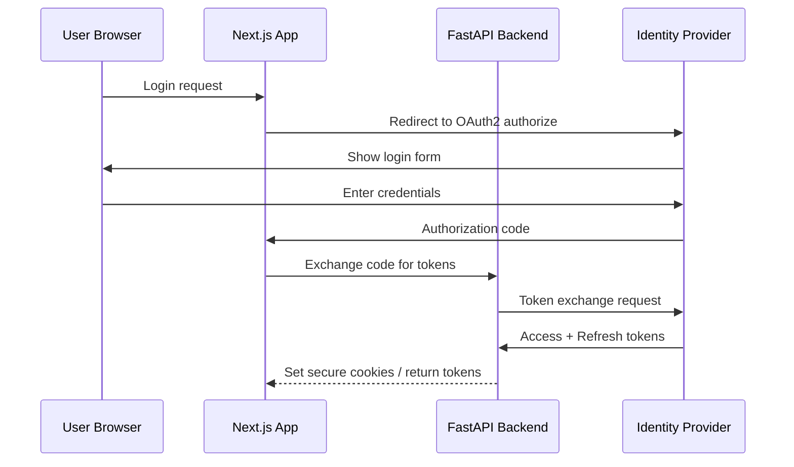

# Authentication & Authorization

> **Status**: Phase 1+ - PLANNED  
> **Last Updated**: 2024-01-XX  
> **Version**: 0.1.0

## ⚠️ IMPORTANT: NOT YET IMPLEMENTED

**Current Status (Phase 0):**
- ❌ No authentication implemented
- ❌ No authorization checks
- ✅ Role definitions documented (this document)
- ✅ RBAC model designed (this document)

This is a design specification for Phase 1 implementation.

---

## Authentication Strategy

### Overview



### Supported Methods (Planned)

| Method | Use Case | Priority |
|--------|----------|----------|
| OAuth2/OIDC | SSO for enterprise users | P0 |
| Email/Password | Direct registration | P1 |
| API Key | Service-to-service | P1 |
| MFA | High-security accounts | P2 |

### Token Structure

```json
{
  "jti": "unique-token-id",
  "sub": "user-uuid",
  "email": "user@example.com",
  "roles": ["analyst"],
  "permissions": ["knowledge:read", "assessment:create"],
  "iat": 1704063600,
  "exp": 1704067200,
  "aud": "fcke-api"
}
```

---

## Authorization Model: Role-Based Access Control (RBAC)

### Roles Definition

#### 1. viewer (Read-Only)
For stakeholders who need read access only.

| Resource | Read | Create | Update | Delete |
|----------|------|--------|--------|--------|
| Public Documents | ✅ | ❌ | ❌ | ❌ |
| Assessments | Own only | ❌ | ❌ | ❌ |
| Reports | Own only | ❌ | ❌ | ❌ |
| Admin Settings | ❌ | ❌ | ❌ | ❌ |

#### 2. analyst (Standard User)
For compliance analysts and researchers.

| Resource | Read | Create | Update | Delete |
|----------|------|--------|--------|--------|
| All Documents | ✅ | ❌ | ❌ | ❌ |
| Assessments | ✅ | ✅ | Own only | Own only |
| Notes/Annotations | ✅ | ✅ | Own only | Own only |
| Saved Searches | ✅ | ✅ | Own only | Own only |

#### 3. admin (Administrator)
For platform administrators.

| Resource | Read | Create | Update | Delete |
|----------|------|--------|--------|--------|
| All Documents | ✅ | ✅ | ✅ | ✅ |
| All Assessments | ✅ | ✅ | ✅ | ✅ |
| Users | ✅ | ✅ | ✅ | ✅ |
| System Config | ✅ | ✅ | ✅ | - |
| Audit Logs | ✅ | ❌ | ❌ | ❌ |

#### 4. system (Service Account)
For background workers and integrations.

| Permission | Scope |
|------------|-------|
| Full document access | Ingestion jobs |
| Assessment processing | Worker tasks |
| Internal API calls | Service mesh |

---

### Permissions Matrix

```python
# Planned permission constants
class Permission(str, Enum):
    # Knowledge operations
    KNOWLEDGE_READ = "knowledge:read"
    KNOWLEDGE_WRITE = "knowledge:write"
    KNOWLEDGE_DELETE = "knowledge:delete"
    
    # Assessment operations
    ASSESSMENT_CREATE = "assessment:create"
    ASSESSMENT_READ = "assessment:read"
    ASSESSMENT_UPDATE = "assessment:update"
    ASSESSMENT_DELETE = "assessment:delete"
    
    # User management
    USER_READ = "user:read"
    USER_CREATE = "user:create"
    USER_UPDATE = "user:update"
    USER_DELETE = "user:delete"
    
    # Admin operations
    ADMIN_CONFIG = "admin:config"
    AUDIT_LOG_READ = "audit:read"
    SYSTEM_HEALTH = "system:health"
```

---

### Implementation Design (Phase 1)

#### Middleware Architecture

```python
# Planned authentication middleware
async def get_current_user(
    request: Request,
    db: AsyncSession = Depends(get_db),
) -> User:
    """Extract and validate user from JWT token."""
    token = extract_bearer_token(request)
    payload = decode_and_validate_jwt(token)
    user = await get_user_by_id(db, payload["sub"])
    if not user or not user.is_active:
        raise UnauthorizedError()
    return user


# Planned authorization dependency
def require_permissions(*permissions: Permission):
    """Dependency that checks user has required permissions."""
    async def checker(user: User = Depends(get_current_user)):
        if not user.has_permissions(permissions):
            raise ForbiddenError()
        return user
    return checker
```

#### Endpoint Protection Example

```python
@router.get("/v1/documents")
async def list_documents(
    user: User = Depends(require_permissions(Permission.KNOWLEDGE_READ)),
    db: AsyncSession = Depends(get_db),
):
    """List documents - requires knowledge:read permission."""
    ...
```

---

## Session Management

### Token Lifecycle
| Event | Action |
|-------|--------|
| Login | Issue access token (15 min) + refresh token (7 days) |
| API Call | Validate access token, check expiry |
| Token Expired | Return 401, client uses refresh token |
| Refresh Success | Issue new access token pair |
| Refresh Failed | Re-authenticate required |
| Logout | Blacklist refresh token |
| Password Change | Invalidate all sessions |

### Secure Cookie Settings (Web Client)
```
Set-Cookie: token=...; 
          HttpOnly; 
          Secure; 
          SameSite=Strict; 
          Path=/;
          Max-Age=604800
```

---

## Rate Limiting (Planned)

| Tier | Requests/Minute | Use Case |
|------|-----------------|----------|
| Anonymous | 10/min | Health checks, public info |
| Authenticated | 100/min | Normal usage |
| Premium | 500/min | Enterprise users |
| Service Account | 1000/min | Background workers |

---

## Implementation Timeline

| Feature | Phase | Status |
|---------|-------|--------|
| Basic JWT auth | Phase 1 | ⚪ PLANNED |
| Role definitions | Phase 1 | ⚪ PLANNED |
| RBAC enforcement | Phase 1 | ⚪ PLANNED |
| OAuth2/OIDC | Phase 1 | ⚪ PLANNED |
| MFA support | Phase 2 | ⚪ PLANNED |
| Fine-grained permissions | Phase 3 | ⚪ PLANNED |

---

## Related Documents

- [Security Baseline](SECURITY_BASELINE.md)
- ADR-0005: Authentication Strategy
- [Domain Model](../architecture/DOMAIN_MODEL.md)
