# Knowledge Integration Guide

> **Status**: Phase 0 - Specification  
> **Last Updated**: 2024-01-XX  
> **Version**: 0.1.0

## Overview

This document describes how the Financial Crime Knowledge Engine integrates with external knowledge sources, particularly the Knowledge Base repository.

---

## Key Principle

**The Knowledge Base is a SEPARATE repository.** This software implementation does NOT contain Knowledge Base content.

### Repository Relationship

```
financial-crime-knowledge-engine/     # THIS repo (software)
    └── apps/, packages/, etc.        # Executable code
    
knowledge-base/                       # EXTERNAL repo (specification)
    └── phase0/, phase1/, ...         # Knowledge content
```

---

## Knowledge Source Manifest Format

### Manifest File: `knowledge_manifest.yaml`

When ingesting from a knowledge source, a manifest file describes the contents:

```yaml
api_version: v1
manifest_version: "1.0"

source:
  type: git_repository
  url: https://github.com/fcke/knowledge-base
  version: v3.0.1
  commit_sha: abc123def456789...
  
metadata:
  generated_at: 2024-01-15T10:30:00Z
  generated_by: fcke-ingester-v0.1.0

statistics:
  total_documents: 1500
  total_size_bytes: 50000000
  
documents:
  by_type:
    regulation:
      count: 200
      path: /regulations/
    guidance:
      count: 350
      path: /guidance/
    definition:
      count: 400
      path: /definitions/
    case_study:
      count: 250
      path: /case-studies/
    taxonomy:
      count: 300
      path: /taxonomies/

phases:
  - name: phase0
    description: Foundation concepts and definitions
    path: /phase0/
    document_count: 50
  - name: phase1
    description: Core regulations and guidance
    path: /phase1/
    document_count: 500
  - name: phase2
    description: Advanced topics and AI integration
    path: /phase2/
    document_count: 450
  - name: phase3
    description: Enterprise features
    path: /phase3/
    document_count: 500

checksums:
  algorithm: sha256
  manifest_checksum: "hash_of_this_manifest..."
  documents_file: "checksums.sha256"
```

---

## Document Schema (Planned)

### Expected Document Structure

Each knowledge document should follow this structure:

#### Markdown Frontmatter

```markdown
---
id: reg-fca-2023-001
title: "Financial Crime Prevention Regulations"
type: regulation
phase: phase1
version: "1.0"
last_updated: 2023-12-15
tags:
  - aml
  - compliance
  - financial-crime
jurisdiction: UK
authority: FCA
related:
  - reg-fca-2023-002
  - guide-aml-001
---

# Document Content Here...

## Section 1: Overview
...content...
```

### Required Fields

| Field | Type | Description |
|-------|------|-------------|
| id | string | Unique identifier |
| title | string | Human-readable title |
| type | enum | Document classification |
| phase | string | Origin phase |
| version | string | Document version |

### Optional Fields

| Field | Type | Description |
|-------|------|-------------|
| last_updated | date | Last modification date |
| tags | list[string] | Search/classification tags |
| jurisdiction | string | Geographic scope |
| authority | string | Issuing authority |
| related | list[string] | Related document IDs |

---

## Ingestion Pipeline (Phase 1+)

### Planned Flow

```mermaid
graph LR
    A[Trigger] --> B[Fetch Source]
    B --> C[Parse Manifest]
    C --> D[Walk Documents]
    D --> E[Validate Schema]
    E --> F[Extract Metadata]
    F --> G[Calculate Checksum]
    G --> H[Store in DB]
    H --> I[Update Indexes]
    I --> J[Audit Log Entry]
    
    style A fill:#e1f5fe
    style J fill:#c8e6c9
```



### Ingestion Job Configuration

```yaml
# Example job configuration for ingestion
job_type: knowledge_ingestion
config:
  source:
    type: git
    url: https://github.com/fcke/knowledge-base
    branch: main
  
  options:
    full_refresh: false      # Only process changes
    validate_schemas: true   # Validate against schema
    fail_on_error: false     # Continue on individual doc errors
    
  processing:
    chunk_size: 100          # Documents per batch
    concurrency: 4           # Parallel workers
    embed_documents: false   # Skip embedding (Phase 2 feature)
```

---

## Taxonomy Definitions (Reference)

### Document Types

| Type | Description | Examples |
|------|-------------|----------|
| `regulation` | Legal/regulatory text | AML directives, sanctions lists |
| `guidance` | Regulatory guidance | Interpretive notes, FAQs |
| `definition` | Term/concept definition | Glossary entries |
| `case_study` | Real-world examples | Enforcement actions, typologies |
| `taxonomy` | Classification system | Risk categories, entity types |
| `procedure` | Operational steps | KYC procedures, SAR filing |
| `faq` | Common questions | User-facing Q&A |
| `glossary` | Terminology reference | Acronyms, jargon |

### Phases

| Phase | Focus | Content Types |
|-------|-------|---------------|
| phase0 | Foundation | Definitions, glossary, basic taxonomy |
| phase1 | Core | Regulations, key guidance |
| phase2 | Advanced | Case studies, detailed procedures |
| phase3 | Enterprise | Custom content, integrations |

---

## Current Implementation Status

| Capability | Status | Notes |
|------------|--------|-------|
| Manifest schema definition | 📝 SPEC | This document |
| Ingestion job class | 🔵 SCAFFOLDED | `KnowledgeIngestionJob` exists |
| Document parser | ⚪ PLANNED | Phase 1 |
| Checksum calculator | ⚪ PLANNED | Phase 1 |
| Version comparison | ⚪ PLANNED | Phase 1 |
| Incremental sync | ⚪ PLANNED | Phase 2 |

---

## Related Documents

- [Knowledge Base Integration](../docs/architecture/KNOWLEDGE_BASE_INTEGRATION.md)
- [Source of Truth](../docs/architecture/SOURCE_OF_TRUTH.md)
- [Domain Model](../docs/architecture/DOMAIN_MODEL.md)
- ADR-0003: Database Design
